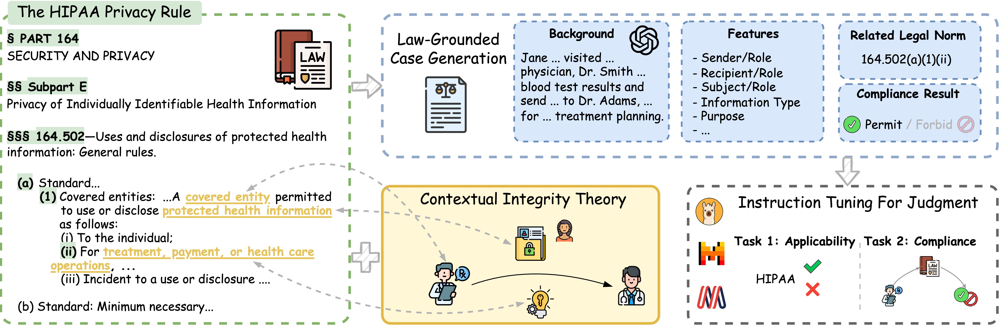

<h1 align="center">  GoldCoin <br> Grounding Large Language Models in Privacy Laws via Contextual Integrity Theory</h1>

[](https://github.com/AlexFanw/GoldCoin/blob/main/LICENSE)
[](https://www.python.org/)

This is the official code and data repository for the EMNLP 2024 (Main Conference) paper: [GoldCoin: Grounding Large Language Models in Privacy Laws via Contextual Integrity Theory](https://arxiv.org/abs/2406.11149)



## \# Setup Environment
Create a conda environment and install dependency:
```bash
conda create -n goldcoin python=3.11
conda activate goldcoin
pip install -r requirements.txt
```

## \# Training
For the `compliance` task, we give the shell based on the `Mistral-7B` model. Please adjust the script as needed for other models or settings.
```bash
cd scripts
sh train_mistral_chat_compliance_cot.sh
```

For the applicability task, use the corresponding shell script:

```bash
cd scripts
sh train_mistral_chat_applicability_cot.sh
```
Training and evaluation data are stored in the `GoldCoin/cases/train_val_test` folder.
You can refer to `train/train.py` to customize the training arguments.
```python
    parser.add_argument("-model", type=str, default="mistral")
    parser.add_argument("-load_in_8bit", action='store_true', default=False)
    parser.add_argument("-chat", action='store_true', default=False)
    parser.add_argument("-batch_size", type=int, default=1)
    parser.add_argument("-micro_batch_size", type=int, default=1)
    parser.add_argument("-rank", type=int, default=8)
    parser.add_argument("-num_epochs", type=int, default=3)
    parser.add_argument("-learning_rate", type=float, default=1e-5)
    parser.add_argument("-save_steps", type=int, default=200)
    parser.add_argument("-eval_steps", type=int, default=100)
    parser.add_argument("-warmup_steps", type=int, default=10)
    parser.add_argument("-logging_steps", type=int, default=10)
    parser.add_argument("-b13", action='store_true', default=False)

    parser.add_argument("-regulation", action='store_true', default=False, help="train on regulation, not cases")
    parser.add_argument("-direct", action='store_true', default=False)
    parser.add_argument("-cot", action='store_true', default=False)
    parser.add_argument("-compliance", action='store_true', default=False)
    parser.add_argument("-applicability", action='store_true', default=False)
```


## \# Evaluation
The evaluation script for the tuned model is provided in the `scripts` folder. Please run the following command to evaluate the model on the test set.
```bash
cd scripts
sh eval_mistral_chat_compliance_cot.sh # compliance task
sh eval_mistral_chat_applicability_cot.sh # applicability task
```
For API-based models (e.g., GPT-3.5-Turbo), update the API key in `models/chatgpt.py` before running:
```bash
cd scripts
sh eval_gpt35_compliance_cot.sh # compliance task
sh eval_gpt35_applicability_cot.sh # applicability task
```
Evaluation results are saved in the `eval/results` folder. Example output:
```bash
              precision    recall  f1-score   support

      forbid     0.4167    0.2500    0.3125        20
      permit     0.8421    0.9195    0.8791        87

    accuracy                         0.7944       107
   macro avg     0.6294    0.5848    0.5958       107
weighted avg     0.7626    0.7944    0.7732       107

Class Metrics:
Class 'forbid': Total = 20, Correct = 5, Error = 15
Class 'permit': Total = 87, Correct = 80, Error = 7
Macro-F1 Score: 0.5958104395604396
Overall Accuracy: 0.794392523364486
```
You can refer `eval/eval_llm.py` and `eval/eval_api.py` to customize the evaluation arguments. We have also provided the evaluation results of overall performance in the `eval/results` folder.


## \# Contact
If you have any comments or questions, please feel free to contact [Wei Fan](mailto:wfanag@connect.ust.hk). We will get back to you as soon as possible.

## \# Citation
If you find this work useful, please consider citing our paper:

```bibtex
@inproceedings{fan2024goldcoin,
  title={GoldCoin: Grounding Large Language Models in Privacy Laws via Contextual Integrity Theory},
  author={Fan, Wei and Li, Haoran and Deng, Zheye and Wang, Weiqi and Song, Yangqiu},
  booktitle={Proceedings of the 2024 Conference on Empirical Methods in Natural Language Processing},
  year={2024}
}
```
